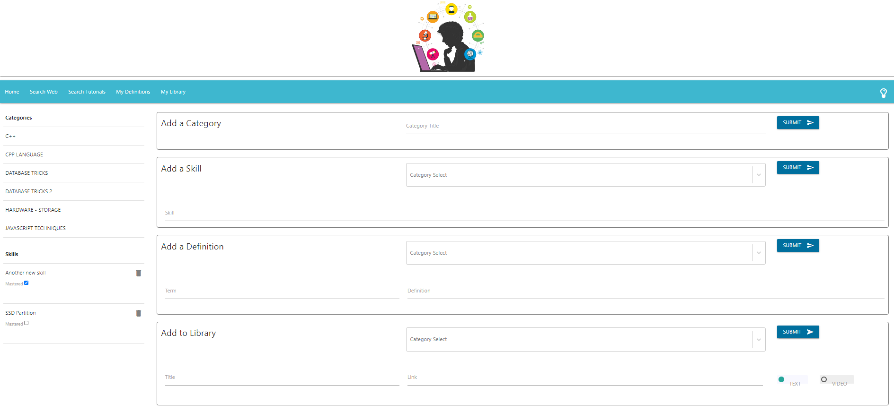

## In the Know -- Your bedside notebook application  
Capture your ideas, skills, terms, interesting web sites all in one place

        

## Description
This application uses React, Router, and other React elements to render the front-end of this application and MondoDB/Mongoose, routes, and express for the backend to create an information repository for the busy developer.
        
# Table of contents
1. [Installation](#installation)
2. [Usage](#usage)
3. [License](#license)
4. [Contributing](#contributing)
5. [Tests](#tests)
6. [Questions](#questions)

## Installation <a name="installation"></a>
The following dependencies need to be installed

```
npm i axios, bcryptjs, body-parser, concurrently, dotenv, express, is-empty, jsonwebtoken, lodash, mongoose, mongoose-timestamp, passport, passport-jwt, path, react-radio-toggle, react-select, react-toggle, react-under-construction, validator
```


## Usage <a name="usage"></a>
Saving and retrieving information of use to the busy developer or knowledge worker

## License <a name="license"></a>
MIT

## Contributing <a name="contributing"></a>
Jessica Hayes, Rob Moel
        
## Tests <a name = "tests"></a>

```
none

```

## Questions <a name ="questions"></a>


If you have an questions about the repo, open an issue or contact [randrmoel](https://api.github.com/users/randrmoel)
at email:robert.moel@rvmconsulting1.com or [JesikaRenea](https://api.github.com/users/JesikaRenea) at email:jessicahayesucf@outlook.com
